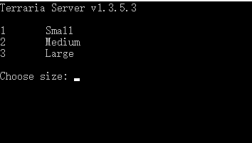

### 问题目标：
我希望用Java来执行Windows下的EXE程序的命令执行和结果获取操作，并且将这些信息可以用网页的形式进行接管；
因此，得到以下最直接的目标
#### 最直接的目标
就是当前模拟的这个Java程序能够直接代替我手工输入命令给正在执行的EXE程序，并且读取它执行命令后返回的结果信息

#### 测试样例([代码在此](src\main\java\Main.java))
---
##### 样例一：执行cmd.exe程序，并输入ipconfig、dir等命令执行，能够达到以上目标，执行结果如下
```
C:\MYSOFTWARES\Java\jdk1.8.0_191\bin\java.exe "-javaagent:C:\MYSOFTWARES\JetBrains\IntelliJ IDEA 2018.2.5\lib\idea_rt.jar=57577:C:\MYSOFTWARES\JetBrains\IntelliJ IDEA 2018.2.5\bin" -Dfile.encoding=UTF-8 -classpath C:\MYSOFTWARES\Java\jdk1.8.0_191\jre\lib\charsets.jar;C:\MYSOFTWARES\Java\jdk1.8.0_191\jre\lib\deploy.jar;C:\MYSOFTWARES\Java\jdk1.8.0_191\jre\lib\ext\access-bridge-64.jar;C:\MYSOFTWARES\Java\jdk1.8.0_191\jre\lib\ext\cldrdata.jar;C:\MYSOFTWARES\Java\jdk1.8.0_191\jre\lib\ext\dnsns.jar;C:\MYSOFTWARES\Java\jdk1.8.0_191\jre\lib\ext\jaccess.jar;C:\MYSOFTWARES\Java\jdk1.8.0_191\jre\lib\ext\jfxrt.jar;C:\MYSOFTWARES\Java\jdk1.8.0_191\jre\lib\ext\localedata.jar;C:\MYSOFTWARES\Java\jdk1.8.0_191\jre\lib\ext\nashorn.jar;C:\MYSOFTWARES\Java\jdk1.8.0_191\jre\lib\ext\sunec.jar;C:\MYSOFTWARES\Java\jdk1.8.0_191\jre\lib\ext\sunjce_provider.jar;C:\MYSOFTWARES\Java\jdk1.8.0_191\jre\lib\ext\sunmscapi.jar;C:\MYSOFTWARES\Java\jdk1.8.0_191\jre\lib\ext\sunpkcs11.jar;C:\MYSOFTWARES\Java\jdk1.8.0_191\jre\lib\ext\zipfs.jar;C:\MYSOFTWARES\Java\jdk1.8.0_191\jre\lib\javaws.jar;C:\MYSOFTWARES\Java\jdk1.8.0_191\jre\lib\jce.jar;C:\MYSOFTWARES\Java\jdk1.8.0_191\jre\lib\jfr.jar;C:\MYSOFTWARES\Java\jdk1.8.0_191\jre\lib\jfxswt.jar;C:\MYSOFTWARES\Java\jdk1.8.0_191\jre\lib\jsse.jar;C:\MYSOFTWARES\Java\jdk1.8.0_191\jre\lib\management-agent.jar;C:\MYSOFTWARES\Java\jdk1.8.0_191\jre\lib\plugin.jar;C:\MYSOFTWARES\Java\jdk1.8.0_191\jre\lib\resources.jar;C:\MYSOFTWARES\Java\jdk1.8.0_191\jre\lib\rt.jar;C:\MYDOCUMENTS\ideaWorkspace\operateExeByJava\target\classes Main
Microsoft Windows [版本 10.0.14393]
(c) 2016 Microsoft Corporation。保留所有权利。

C:\Program Files>dir
dir
 驱动器 C 中的卷没有标签。
 卷的序列号是 920C-F841

 C:\Program Files 的目录

2019/01/15  15:40    <DIR>          .
2019/01/15  15:40    <DIR>          ..
2018/12/26  17:12    <DIR>          Common Files
2018/11/13  18:57    <DIR>          Intel
2018/11/16  18:39    <DIR>          Internet Explorer
2018/11/13  18:59    <DIR>          Lenovo
2018/11/13  19:10    <DIR>          NVIDIA Corporation
2018/11/13  18:52    <DIR>          Realtek
2018/11/13  18:57    <DIR>          Synaptics
2018/11/16  18:39    <DIR>          Windows Defender
2018/11/16  18:39    <DIR>          Windows Defender Advanced Threat Protection
2018/11/16  18:39    <DIR>          Windows Mail
2018/11/16  18:39    <DIR>          Windows Media Player
2016/07/16  19:47    <DIR>          Windows Multimedia Platform
2018/11/13  18:18    <DIR>          Windows NT
2018/11/16  18:39    <DIR>          Windows Photo Viewer
2016/07/16  19:47    <DIR>          Windows Portable Devices
2016/07/16  19:47    <DIR>          WindowsPowerShell
2019/01/15  15:41    <DIR>          Wireshark
               0 个文件              0 字节
              19 个目录 418,108,866,560 可用字节

C:\Program Files>ipconfig
ipconfig

Windows IP 配置


无线局域网适配器 本地连接* 2:

   媒体状态  . . . . . . . . . . . . : 媒体已断开连接
   连接特定的 DNS 后缀 . . . . . . . : 

无线局域网适配器 本地连接* 12:

   媒体状态  . . . . . . . . . . . . : 媒体已断开连接
   连接特定的 DNS 后缀 . . . . . . . : 

以太网适配器 以太网:

   连接特定的 DNS 后缀 . . . . . . . : 
   本地链接 IPv6 地址. . . . . . . . : fe80::d02a:ad80:2d1a:ba97%3
   IPv4 地址 . . . . . . . . . . . . : 192.168.10.16
   子网掩码  . . . . . . . . . . . . : 255.255.255.0
   默认网关. . . . . . . . . . . . . : 192.168.10.1

无线局域网适配器 WLAN:

   媒体状态  . . . . . . . . . . . . : 媒体已断开连接
   连接特定的 DNS 后缀 . . . . . . . : 

以太网适配器 蓝牙网络连接:

   媒体状态  . . . . . . . . . . . . : 媒体已断开连接
   连接特定的 DNS 后缀 . . . . . . . : 

隧道适配器 本地连接* 13:

   媒体状态  . . . . . . . . . . . . : 媒体已断开连接
   连接特定的 DNS 后缀 . . . . . . . : 

隧道适配器 isatap.{1F8B09AA-6A96-4C3D-9AB3-3E3AF9A1D5E3}:

   媒体状态  . . . . . . . . . . . . : 媒体已断开连接
   连接特定的 DNS 后缀 . . . . . . . : 

C:\Program Files>
```
##### 样例一结果描述：
能够达到目标，成功执行输入的命令(dir,ipconfig等)，并及时返回执行结果

---
##### 样例二：执行TerrariaServer.exe程序，并输入选择"n"，回车，发现无响应，执行结果如下
```
C:\MYSOFTWARES\Java\jdk1.8.0_191\bin\java.exe "-javaagent:C:\MYSOFTWARES\JetBrains\IntelliJ IDEA 2018.2.5\lib\idea_rt.jar=57706:C:\MYSOFTWARES\JetBrains\IntelliJ IDEA 2018.2.5\bin" -Dfile.encoding=UTF-8 -classpath C:\MYSOFTWARES\Java\jdk1.8.0_191\jre\lib\charsets.jar;C:\MYSOFTWARES\Java\jdk1.8.0_191\jre\lib\deploy.jar;C:\MYSOFTWARES\Java\jdk1.8.0_191\jre\lib\ext\access-bridge-64.jar;C:\MYSOFTWARES\Java\jdk1.8.0_191\jre\lib\ext\cldrdata.jar;C:\MYSOFTWARES\Java\jdk1.8.0_191\jre\lib\ext\dnsns.jar;C:\MYSOFTWARES\Java\jdk1.8.0_191\jre\lib\ext\jaccess.jar;C:\MYSOFTWARES\Java\jdk1.8.0_191\jre\lib\ext\jfxrt.jar;C:\MYSOFTWARES\Java\jdk1.8.0_191\jre\lib\ext\localedata.jar;C:\MYSOFTWARES\Java\jdk1.8.0_191\jre\lib\ext\nashorn.jar;C:\MYSOFTWARES\Java\jdk1.8.0_191\jre\lib\ext\sunec.jar;C:\MYSOFTWARES\Java\jdk1.8.0_191\jre\lib\ext\sunjce_provider.jar;C:\MYSOFTWARES\Java\jdk1.8.0_191\jre\lib\ext\sunmscapi.jar;C:\MYSOFTWARES\Java\jdk1.8.0_191\jre\lib\ext\sunpkcs11.jar;C:\MYSOFTWARES\Java\jdk1.8.0_191\jre\lib\ext\zipfs.jar;C:\MYSOFTWARES\Java\jdk1.8.0_191\jre\lib\javaws.jar;C:\MYSOFTWARES\Java\jdk1.8.0_191\jre\lib\jce.jar;C:\MYSOFTWARES\Java\jdk1.8.0_191\jre\lib\jfr.jar;C:\MYSOFTWARES\Java\jdk1.8.0_191\jre\lib\jfxswt.jar;C:\MYSOFTWARES\Java\jdk1.8.0_191\jre\lib\jsse.jar;C:\MYSOFTWARES\Java\jdk1.8.0_191\jre\lib\management-agent.jar;C:\MYSOFTWARES\Java\jdk1.8.0_191\jre\lib\plugin.jar;C:\MYSOFTWARES\Java\jdk1.8.0_191\jre\lib\resources.jar;C:\MYSOFTWARES\Java\jdk1.8.0_191\jre\lib\rt.jar;C:\MYDOCUMENTS\ideaWorkspace\operateExeByJava\target\classes Main
TerrariaAPI Version: 2.1.0.0 (Protocol v1.3.5.3 (194), OTAPI 1.3.5.3)
TShock was improperly shut down. Please use the exit command in the future to prevent this.
TShock 4.3.25.0 (Mintaka) now running.
AutoSave Enabled
Backups Disabled
Welcome to TShock for Terraria. Initialization complete.
[Server API] Info Plugin TShock v4.3.25.0 (by The TShock Team) initiated.
Terraria Server v1.3.5.3

n	New World
d <number>Delete World

Choose World: n

```
##### 样例二结果描述：
无法达到目标，输入选择"n"，结果无法显示返回信息，而是卡住无响应了
##### 样例二的期望结果：
直接打开文件夹tshock_4.3.25，并手动双击执行TerrariaServer.exe文件，然后选择"n"
本应该会显示如下信息：
